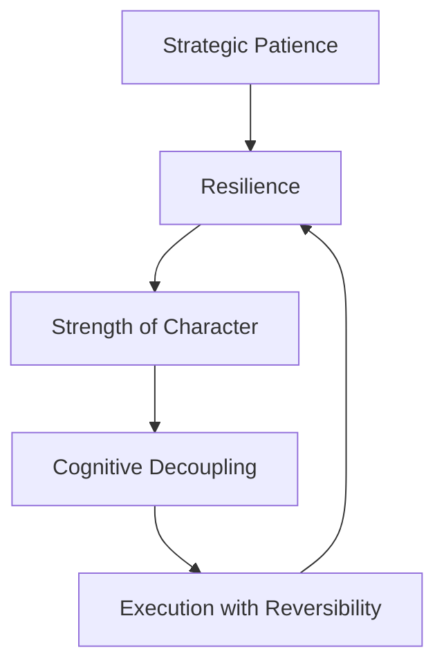

# Domain: Character Core

## What is Character Core?
**Character Core** is the internal strength that enables composure, courage, and clarity in moments of stress, uncertainty, and pressure. It is the invisible force that steadies action when fear, ego, or fatigue threaten to derail it.

This domain reflects not just what a person can do—but who they choose to be when it matters.

> "You don’t rise to the occasion. You fall to the level of your systems—and character is the deepest system of all."

---

## Why It Matters
Character Core is what sustains:
- Long-term trust and credibility
- Clear action under emotional volatility
- Leadership in ambiguous or high-stakes moments
- Resilience during failure, rejection, and adversity

It is essential for:
- Founders
- Team leads
- Crisis managers
- Coaches
- Product and design leaders

---

## Meta-Skills in This Domain

| Meta-Skill | What It Enables | Real-World Use | Example |
|------------|------------------|----------------|---------|
| **Strategic Patience** | Delaying gratification and resisting reactive action | Long product cycles, career shaping, team scaling | Saying "not yet" to a tempting feature launch to preserve long-term coherence |
| **Resilience** | Bouncing forward from failure and criticism | Iterating through failure, taking tough calls | Staying energized and clear after a public launch flops |
| **Strength of Character** | Upholding values under pressure or ambiguity | Ethical clarity, trust-building, integrity | Refusing to fudge data under pressure—even at cost |
| **Cognitive Decoupling** | Separating emotions from logic in real-time | High-pressure decision-making, negotiations | Responding calmly to a confrontational exec or stakeholder |
| **Execution with Reversibility** | Taking bold action while managing downside | Fast pivots, MVPs, experimentation | Launching a feature with toggles and kill-switches to test safely |

---

## Where Character Core Matters Most

| Role / Context | Why It’s Critical |
|----------------|------------------|
| **Founders** | Grit and restraint separate those who build enduring companies from those who burn out or sell short |
| **Product Leaders** | Need to protect vision while adapting to internal and external noise |
| **Org Leaders** | Must make and hold difficult calls with clarity and compassion |
| **People Managers** | Daily exposure to interpersonal tension, performance dilemmas, and emotional load |
| **Ethical Decision-Makers** | Often no clear rules—character is the only compass |

---

## Coaching and Evaluation Suggestions
- **Decision Logs**: Track how people decide under pressure.
- **Pre-mortems**: Reveal patience vs. impulse.
- **Adversity Stories**: Ask for moments of rejection or failure—what happened next?
- **Ethics Scenarios**: Present moral ambiguity and watch how principles hold.

---

## Character Core in Practice (Flow of Reinforcement)

This loop reflects how inner composure builds adaptive action—and how action then tests and reinforces character.

---

## Related Domains
- **Cognitive Mastery** – You can’t reason clearly if your character wavers.
- **Trust Dynamics** – People follow those with deep integrity and emotional steadiness.

---

## Tags
`#meta-domain` `#character-core` `#resilience` `#grit` `#stratum-framework`

 
