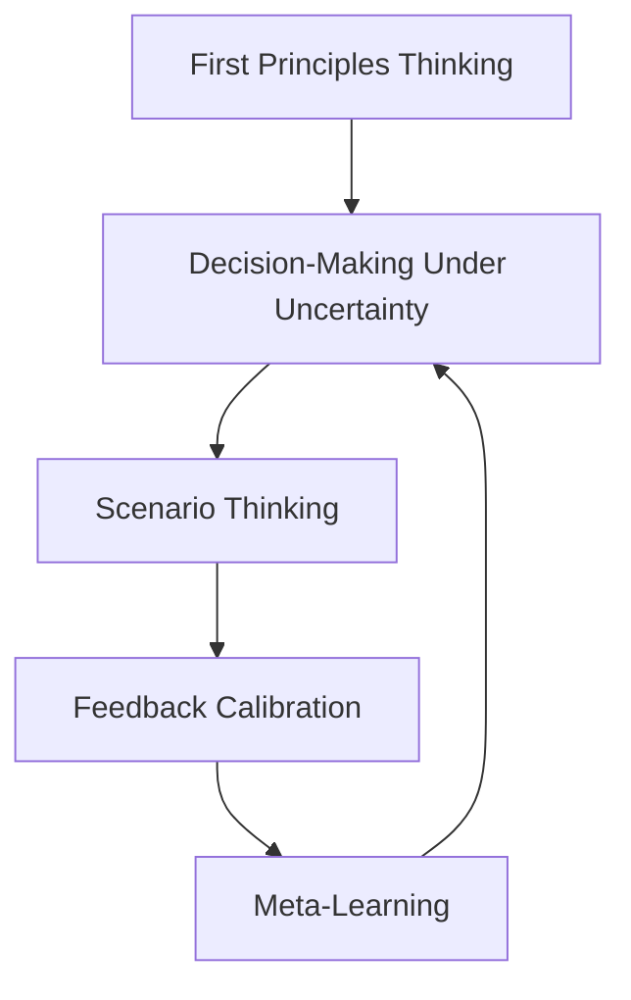

# Domain: Cognitive Mastery

## What is Cognitive Mastery?
**Cognitive Mastery** is the ability to think clearly, decide effectively, and learn rapidly—especially under pressure. It is the mental core of high-performance work. When hiring, Cognitive Mastery signals how well someone will navigate ambiguous problems.

This domain is what distinguishes elite strategists, resilient founders, and product thinkers. It doesn't just enable smart thinking—it enables **forward movement when the path isn’t clear**.

> "In foggy terrain with no map, Cognitive Mastery becomes the GPS you build as you walk."

---

## Why It Matters
Cognitive Mastery enables:
- Clear thinking when faced with complexity.
- Action without needing perfect information.
- Iteration based on learning—not ego.
- Pattern recognition across contexts.

It underpins high-leverage work in:
- Startups
- Strategy
- AI/ML
- Product management
- Crisis navigation

---

## Meta-Skills in This Domain

| Meta-Skill | What It Enables | Real-World Use | Example |
|------------|------------------|----------------|---------|
| **First Principles Thinking** | Clear reasoning from the ground up | Solving non-obvious problems in new domains | Re-architecting a pricing model from value delivered, not market norms |
| **High-Quality Decision-Making** | Choosing well under ambiguity and risk | Product bets, GTM pivots, org design | Deciding whether to launch a flawed feature or hold off and risk being late |
| **Scenario Thinking** | Simulating multiple futures before acting | Forecasting, debugging strategy, de-risking choices | Mapping 3 possible outcomes of a hiring freeze or expansion |
| **Feedback Calibration** | Adjusting fast, learning continuously | Rapid iteration, product validation, hiring signals | Rewriting your roadmap every 2 weeks based on what’s working |
| **Meta-Learning** | Acquiring complex new skills fast | Cross-domain shifts, tech upskilling, leadership transitions | Teaching yourself enough about LLMs to manage a team in 90 days |

---

## Where Cognitive Mastery Matters Most

| Role / Context | Why It’s Critical |
|----------------|------------------|
| **Startup Founder** | Every major decision must be made without clarity. Mastery enables motion. |
| **Product Leader** | Prioritization, roadmap shifts, and tradeoff clarity hinge on this domain. |
| **AI/ML Builder** | New fields evolve fast—problem decomposition and scenario forecasting is essential. |
| **Crisis Operator** | Must act under time pressure with partial data and high emotion. |
| **Generalist Operator** | Cognitive flexibility = velocity across unknowns. |

---

## Coaching and Evaluation Suggestions
- **Simulations**: Run ambiguous scenarios with structured debriefs.
- **Socratic Drills**: Have team members break down a known decision from first principles.
- **Feedback Logs**: Track version histories of key decisions or ideas to surface calibration skill.
- **Learning Journals**: Ask for reflection on how they learned something new fast.

---

## Cognitive Flywheel (How Skills Reinforce Each Other)

Each skill builds upon and reinforces the next. This is not a checklist—it’s a **loop**.

---

## Related Domains
- **Emotional & Identity** – Helps regulate ego, fear, and impulsivity during cognitive strain.
- **Social & Relational** – Turns clear thinking into clearly communicated action.

---

## Tags
`#meta-domain` `#cognitive-mastery` `#decision-loops` `#stratum-framework`