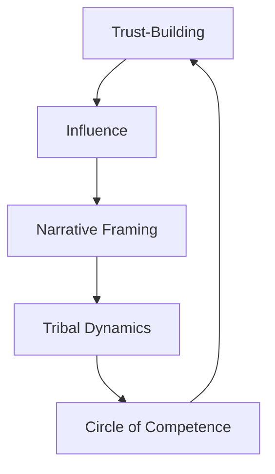

# Domain: Trust Dynamics

## What is Trust Dynamics?
**Trust Dynamics** is the domain of influence, alignment, communication, and collaboration. It governs how trust is earned, transferred, repaired, and expanded within teams and across systems. Scaling teams depends on the invisible trust flows this domain makes explicit.

This domain isn't about being liked—it's about being trusted, understood, and followed when it counts.

> "In systems under pressure, trust becomes the highest bandwidth protocol. When it flows, work accelerates. When it breaks, nothing else matters."

---

## Why It Matters
Trust Dynamics allows teams to:
- Communicate ideas with precision and credibility
- Influence without authority
- Align quickly and recover from tension
- Build systems that scale human coordination

It enables:
- High-functioning teams
- Respected leadership
- Healthy cultures
- Resilient stakeholder relationships

---

## Meta-Skills in This Domain

| Meta-Skill | What It Enables | Real-World Use | Example |
|------------|------------------|----------------|---------|
| **Trust-Building** | Creating psychological safety, dependability, and mutual respect | Team performance, long-term loyalty | Showing up consistently and vulnerably over months to win true followership |
| **Ability to Influence** | Shaping decisions and direction without formal power | Cross-functional alignment, stakeholder buy-in | Persuading engineering to change roadmap through clear logic and empathy |
| **Narrative Framing** | Guiding perception and focus through story | Change management, product strategy, hiring | Reframing a cost-cutting move as a refocus on core strengths |
| **Tribal Dynamics** | Navigating group identity, rituals, and informal power | Leadership, hiring, org design | Preserving team culture during hypergrowth by designing new rituals |
| **Circle of Competence** | Communicating clearly where your strengths end and others begin | Trust calibration, delegation, integrity | Admitting you don’t know AI infra—and bringing in the right expert |

---

## Where Trust Dynamics Matters Most

| Role / Context | Why It’s Critical |
|----------------|------------------|
| **Cross-Functional Leaders** | Must influence without command-and-control authority |
| **Designers & PMs** | Clarity and persuasion define what gets built |
| **Founders** | Fundraising, team building, and momentum depend on narrative trust |
| **Org Architects** | Cultural scaling requires engineered trust flows |
| **Coaches & Mentors** | Credibility is the currency of transformation |

---

## Coaching and Evaluation Suggestions
- **Influence Maps**: Ask how they move decisions without positional power
- **Framing Drills**: Practice telling the same fact in three story frames
- **Credibility Reviews**: Ask teams who they trust and why
- **Shadow Feedback**: Observe live meetings and note social weight, not just speech volume

---

## Trust as a Dynamic System

Each skill feeds and expands the others. High-trust environments are not accidents—they are designed.

---

## Related Domains
- **Character Core** – Trust begins at the level of values and consistency.
- **Cognitive Mastery** – Clear thought enables persuasive clarity.

---

## Tags
`#meta-domain` `#trust-dynamics` `#influence` `#narrative` `#alignment` `#stratum-framework`

 
